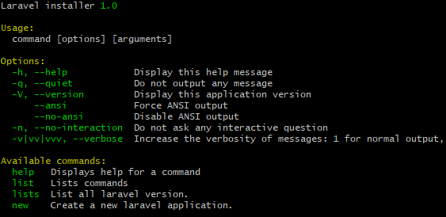

## Notice
In order to use this tool globally, you need to install [vsfdqfpdpg/phar](https://github.com/vsfdqfpdpg/phar) first.

## Install
```
git clone https://github.com/vsfdqfpdpg/laravel-installer.git
cd laravel-installer
composer install
phar archive
laravel
```
If everything run successfully, You will see output below.


## Usage
Command                       | Description
----------------------------- | -----------
laravel lists                 | This will show you all the available laravel version that you can chose from.
laravel new directory version | Version parameter you can use digest number without dot.